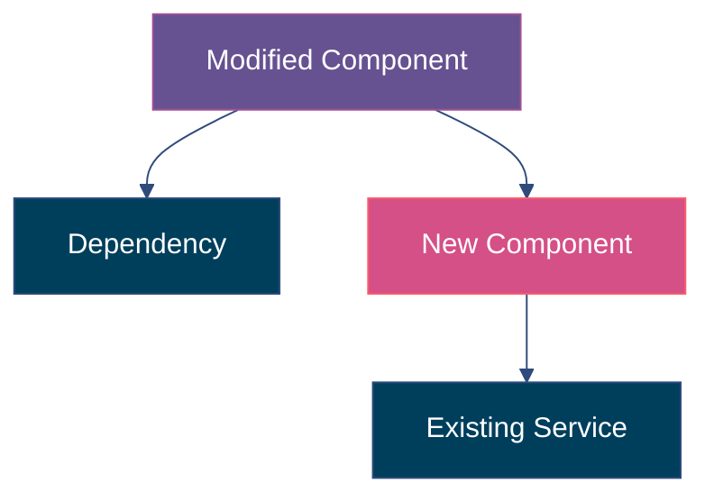
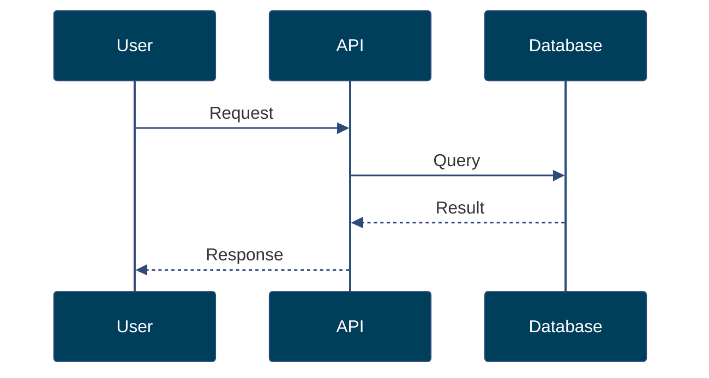

# Ship - PR Creation with Mermaid Diagrams

Create a well-documented pull request with mermaid architecture diagrams, test evidence, and full context.

## Usage
```
/ship [--repo owner/repo] [--base main] [--issue number]
```

## Parameters
- `--repo`: Target repository (default: current repo)
- `--base`: Base branch (default: main)
- `--issue`: Issue number to link (optional)

## Workflow

### Step 0: Resolve paths

```bash
CW_HOME=$(python3 -c "from pathlib import Path; print(Path('__file__').resolve().parent.parent.parent)" 2>/dev/null || echo "$HOME/repos/chief-wiggum")
DEFAULT_BRANCH=$(gh repo view --json defaultBranchRef -q .defaultBranchRef.name 2>/dev/null || echo "main")
```

### Step 1: Analyse the diff

Get the full diff and commit history for the current branch:

```bash
git log --oneline $DEFAULT_BRANCH..HEAD
git diff --stat $DEFAULT_BRANCH...HEAD
git diff $DEFAULT_BRANCH...HEAD
```

Understand:
- What files were changed and why
- The scope of changes (new files, modified files, deleted files)
- The commit history narrative

### Step 2: Generate mermaid diagrams

Based on the diff analysis, generate appropriate mermaid diagrams:

**Color palette** — all mermaid diagrams must use this palette via `%%{init:}%%` theme overrides:

```
#003f5c  (deep navy)
#2f4b7c  (slate blue)
#665191  (muted purple)
#a05195  (plum)
#d45087  (rose)
#f95d6a  (coral)
#ff7c43  (tangerine)
#ffa600  (amber)
```

Apply it by adding a theme init block at the top of every mermaid diagram:

```mermaid
%%{init: {'theme': 'base', 'themeVariables': {'primaryColor': '#003f5c', 'primaryTextColor': '#fff', 'primaryBorderColor': '#2f4b7c', 'secondaryColor': '#665191', 'tertiaryColor': '#a05195', 'lineColor': '#2f4b7c', 'textColor': '#333'}}}%%
```

Use `style` directives to assign specific palette colours to nodes based on their role:
- `#003f5c` / `#2f4b7c` — existing infrastructure, databases, external services
- `#665191` / `#a05195` — modified components
- `#d45087` / `#f95d6a` — new components added in this PR
- `#ff7c43` / `#ffa600` — user-facing / entry points

**Component Relationship Diagram** (always include):
Show the components that were changed and how they relate to each other.



**Data Flow Diagram** (include if data flow changed):
Show how data moves through the modified components.



**Before/After** (include if architecture changed):
Show the structural change.

Guidelines for diagrams:
- Keep them focused on what changed, not the entire system
- Use descriptive node labels
- Highlight new components vs modified ones using the classDef colour roles above
- Maximum 15 nodes per diagram (simplify if larger)

### Step 3: Verify and compile test evidence

**Always re-run tests before shipping.** Do not rely on stale results from earlier in the session — code may have changed since tests last ran.

```bash
# Find and run tests (detect project type)
if [ -f "go.mod" ]; then
  go test ./... 2>&1 | tail -20
elif [ -f "package.json" ]; then
  npm test 2>&1 | tail -20
elif [ -f "pyproject.toml" ] || [ -f "setup.py" ]; then
  pytest 2>&1 | tail -20
fi
```

If tests fail, **stop and fix them**. Do not create a PR with failing tests.

If browser-use screenshots exist, reference them.

### Step 4: Draft the PR

Using the template at `$CW_HOME/templates/pr.md`, fill in:

- **Title**: From the ticket title or derived from changes. Keep under 70 characters.
  - Format: `feat: Add dark mode toggle` or `fix: Resolve login crash on empty form`

- **Summary**: 2-3 sentences on what was done and why.

- **Architecture**: The mermaid diagrams from Step 2.

- **Changes**: Bullet list of significant changes (not every line, but the meaningful ones).

- **Test Evidence**: Test output and browser-use results.

- **Review Checklist**: Pre-filled based on what was actually done.

### Step 5: Preview and confirm

Show the user the full PR body and ask:
1. Does the summary capture it?
2. Are the diagrams accurate?
3. Any additional context to add?
4. Ready to create?

### Step 6: Create the PR

```bash
git push -u origin HEAD
```

```bash
gh pr create \
  --repo "$owner_repo" \
  --title "$title" \
  --body "$body" \
  --base "$base_branch"
```

If an issue was specified, it should be linked via "Closes #N" in the body.

### Step 7: Report

Show:
- PR URL
- PR number
- Files changed count
- Suggest: "Want me to request reviewers or add labels?"
