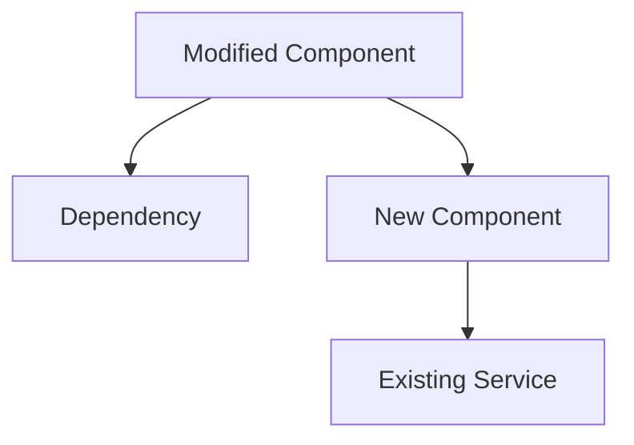
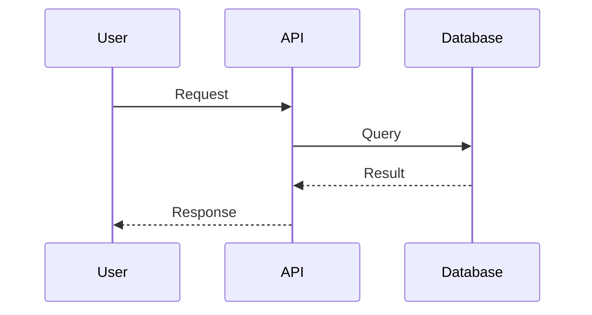

# Ship - PR Creation with Mermaid Diagrams

Create a well-documented pull request with mermaid architecture diagrams, test evidence, and full context.

## Usage
```
/ship [--repo owner/repo] [--base main] [--issue number]
```

## Parameters
- `--repo`: Target repository (default: current repo)
- `--base`: Base branch (default: main)
- `--issue`: Issue number to link (optional)

## Workflow

### Step 1: Analyse the diff

Get the full diff and commit history for the current branch:

```bash
git log --oneline main..HEAD
git diff --stat main...HEAD
git diff main...HEAD
```

Understand:
- What files were changed and why
- The scope of changes (new files, modified files, deleted files)
- The commit history narrative

### Step 2: Generate mermaid diagrams

Based on the diff analysis, generate appropriate mermaid diagrams:

**Component Relationship Diagram** (always include):
Show the components that were changed and how they relate to each other.



**Data Flow Diagram** (include if data flow changed):
Show how data moves through the modified components.



**Before/After** (include if architecture changed):
Show the structural change.

Guidelines for diagrams:
- Keep them focused on what changed, not the entire system
- Use descriptive node labels
- Highlight new components vs modified ones
- Maximum 15 nodes per diagram (simplify if larger)

### Step 3: Compile test evidence

Gather test results from the current session or re-run:

```bash
# Find and run tests (detect project type)
if [ -f "go.mod" ]; then
  go test ./... 2>&1 | tail -20
elif [ -f "package.json" ]; then
  npm test 2>&1 | tail -20
elif [ -f "pyproject.toml" ] || [ -f "setup.py" ]; then
  pytest 2>&1 | tail -20
fi
```

If browser-use screenshots exist, reference them.

### Step 4: Draft the PR

Using the template at `~/repos/chief-wiggum/templates/pr.md`, fill in:

- **Title**: From the ticket title or derived from changes. Keep under 70 characters.
  - Format: `feat: Add dark mode toggle` or `fix: Resolve login crash on empty form`

- **Summary**: 2-3 sentences on what was done and why.

- **Architecture**: The mermaid diagrams from Step 2.

- **Changes**: Bullet list of significant changes (not every line, but the meaningful ones).

- **Test Evidence**: Test output and browser-use results.

- **Review Checklist**: Pre-filled based on what was actually done.

### Step 5: Preview and confirm

Show the user the full PR body and ask:
1. Does the summary capture it?
2. Are the diagrams accurate?
3. Any additional context to add?
4. Ready to create?

### Step 6: Create the PR

```bash
git push -u origin HEAD
```

```bash
gh pr create \
  --repo "$owner_repo" \
  --title "$title" \
  --body "$body" \
  --base "$base_branch"
```

If an issue was specified, it should be linked via "Closes #N" in the body.

### Step 7: Report

Show:
- PR URL
- PR number
- Files changed count
- Suggest: "Want me to request reviewers or add labels?"
