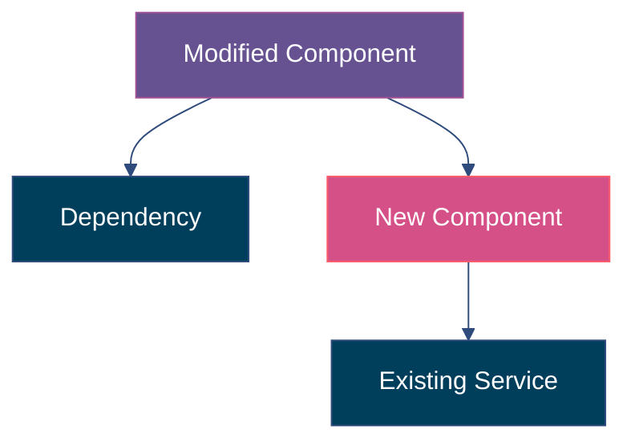
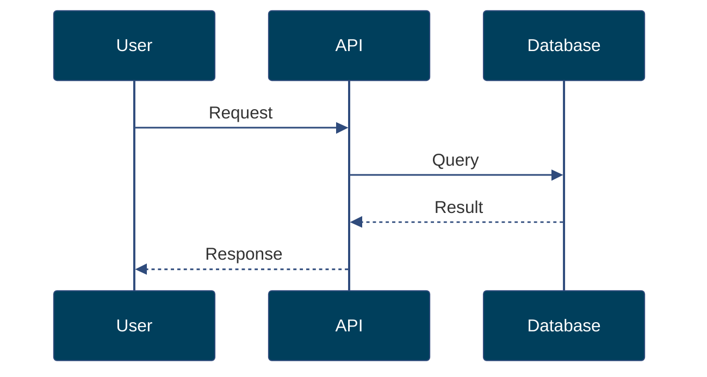

# Ship - PR Creation with Mermaid Diagrams

Create a well-documented pull request with mermaid architecture diagrams, test evidence, and full context.

## Usage
```
/ship [--repo owner/repo] [--base main] [--issue number]
```

## Parameters
- `--repo`: Target repository (default: current repo)
- `--base`: Base branch (default: main)
- `--issue`: Issue number to link (optional)

## Workflow

### Step 0: Resolve paths

```bash
CW_HOME="${CHIEF_WIGGUM_HOME:-$HOME/repos/chief-wiggum}"
CW_HOME=$(python3 "$CW_HOME/scripts/env.py" home)
DEFAULT_BRANCH=$(gh repo view --json defaultBranchRef -q .defaultBranchRef.name 2>/dev/null || echo "main")
```

### Step 1: Analyse the diff

Get the full diff and commit history for the current branch:

```bash
git log --oneline $DEFAULT_BRANCH..HEAD
git diff --stat $DEFAULT_BRANCH...HEAD
git diff $DEFAULT_BRANCH...HEAD
```

Understand:
- What files were changed and why
- The scope of changes (new files, modified files, deleted files)
- The commit history narrative

### Step 2: Generate mermaid diagrams

Based on the diff analysis, generate appropriate mermaid diagrams:

**Color palette** — all mermaid diagrams must use this palette via `%%{init:}%%` theme overrides:

```
#003f5c  (deep navy)
#2f4b7c  (slate blue)
#665191  (muted purple)
#a05195  (plum)
#d45087  (rose)
#f95d6a  (coral)
#ff7c43  (tangerine)
#ffa600  (amber)
```

Apply it by adding a theme init block at the top of every mermaid diagram:

```mermaid
%%{init: {'theme': 'base', 'themeVariables': {'primaryColor': '#003f5c', 'primaryTextColor': '#fff', 'primaryBorderColor': '#2f4b7c', 'secondaryColor': '#665191', 'tertiaryColor': '#a05195', 'lineColor': '#2f4b7c', 'textColor': '#333'}}}%%
```

Use `style` directives to assign specific palette colours to nodes based on their role:
- `#003f5c` / `#2f4b7c` — existing infrastructure, databases, external services
- `#665191` / `#a05195` — modified components
- `#d45087` / `#f95d6a` — new components added in this PR
- `#ff7c43` / `#ffa600` — user-facing / entry points

**Component Relationship Diagram** (always include):
Show the components that were changed and how they relate to each other.


```mermaid
%%{init: {'theme': 'base', 'themeVariables': {'primaryColor': '#003f5c', 'primaryTextColor': '#fff', 'primaryBorderColor': '#2f4b7c', 'secondaryColor': '#665191', 'tertiaryColor': '#a05195', 'lineColor': '#2f4b7c', 'textColor': '#333'}}}%%
graph TD
    A[Modified Component]:::modified --> B[Dependency]:::existing
    A --> C[New Component]:::new
    C --> D[Existing Service]:::existing
    classDef existing fill:#003f5c,stroke:#2f4b7c,color:#fff
    classDef modified fill:#665191,stroke:#a05195,color:#fff
    classDef new fill:#d45087,stroke:#f95d6a,color:#fff
    classDef entry fill:#ff7c43,stroke:#ffa600,color:#fff
```

**Data Flow Diagram** (include if data flow changed):
Show how data moves through the modified components.


```mermaid
%%{init: {'theme': 'base', 'themeVariables': {'primaryColor': '#003f5c', 'primaryTextColor': '#fff', 'primaryBorderColor': '#2f4b7c', 'secondaryColor': '#665191', 'tertiaryColor': '#a05195', 'lineColor': '#2f4b7c', 'textColor': '#333', 'actorTextColor': '#fff', 'actorBkg': '#003f5c', 'actorBorder': '#2f4b7c', 'activationBorderColor': '#d45087', 'activationBkgColor': '#f95d6a', 'signalColor': '#2f4b7c'}}}%%
sequenceDiagram
    participant U as User
    participant A as API
    participant D as Database
    U->>A: Request
    A->>D: Query
    D-->>A: Result
    A-->>U: Response
```

**Before/After** (include if architecture changed):
Show the structural change.

Guidelines for diagrams:
- Keep them focused on what changed, not the entire system
- Use descriptive node labels
- Highlight new components vs modified ones using the classDef colour roles above
- Maximum 15 nodes per diagram (simplify if larger)

### Step 3: Verify and compile test evidence

**Always re-run tests before shipping.** Do not rely on stale results from earlier in the session — code may have changed since tests last ran.

The verification runner detects the project type (Go/Node/Python/Make/Docker/Playwright), runs the requested profiles, and emits structured evidence (command, exit code, duration, log tail) for the PR body:

```bash
python3 "$CW_HOME/scripts/run_verification.py" --repo "$(git rev-parse --show-toplevel)" --profile test,lint --markdown
```

It exits non-zero if any step fails. **If tests fail, stop and fix them** — do not create a PR with failing tests. Use `--dry-run` first to see the planned commands, and add `build`/`smoke` to `--profile` when relevant.

If browser-use screenshots exist, reference them.

### Step 4: Draft the PR

Assemble the PR body with the tested helper. It folds in the verification evidence, optional model-conformance/UX manifests, and a Mermaid diagram (themed with the shared palette automatically), validates the required sections, and can print the `gh pr create` command:

```bash
python3 "$CW_HOME/scripts/draft_pr.py" \
  --issue "$issue_number" --title "$title" --summary "$summary" \
  --change "Change 1" --change "Change 2" \
  --mermaid-file "$CW_TMP/architecture.mmd" \
  --verification "$CW_TMP/verification.json" \
  --base "$base_branch" --out "$CW_TMP/pr-body.md" --print-command
```

The Mermaid palette no longer needs to be hand-copied — `draft_pr.py` injects the `%%{init}%%` theme (use `--mermaid-sequence` for sequence diagrams). The diagram *content* is still yours to author. It exits non-zero if a required section (Summary, Changes, Test Evidence) is missing.

### Step 5: Preview and confirm

Show the user the full PR body and ask:
1. Does the summary capture it?
2. Are the diagrams accurate?
3. Any additional context to add?
4. Ready to create?

### Step 6: Create the PR

```bash
git push -u origin HEAD
```

```bash
gh pr create \
  --repo "$owner_repo" \
  --title "$title" \
  --body-file "$CW_TMP/pr-body.md" \
  --base "$base_branch"
```

If an issue was specified, it should be linked via "Closes #N" in the body.

### Step 7: Report

Show:
- PR URL
- PR number
- Files changed count
- Suggest: "Want me to request reviewers or add labels?"
