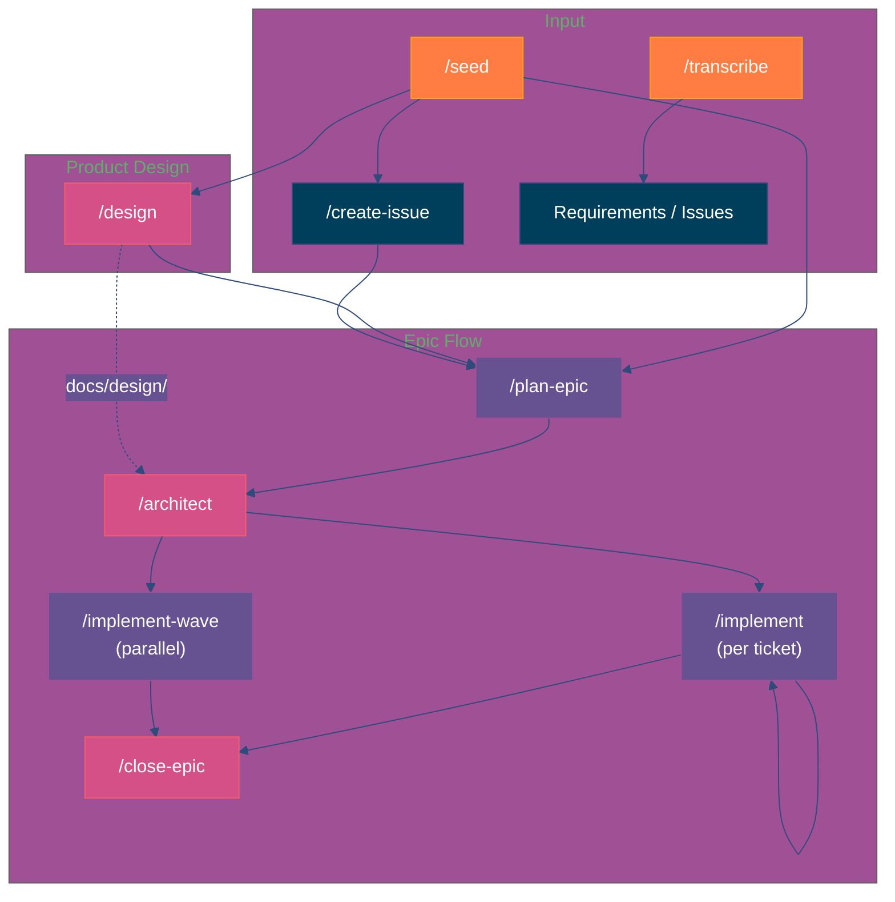
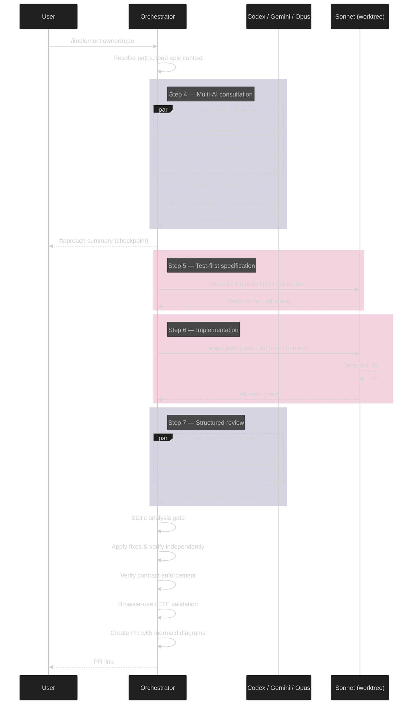
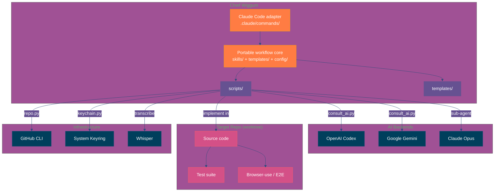

# Chief Wiggum

Harness-portable agentic SDLC orchestration. It turns vague tickets into a disciplined delivery loop: requirements capture, epic planning, architecture, test-first implementation, structured review, and PR-ready output.

## Why This Exists

- Most AI coding workflows optimise for fast patches, not for system quality, traceability, or safe delivery.
- Chief Wiggum adds explicit contracts, multi-model consultation, worktree isolation, independent verification, and GitHub-integrated shipping steps.
- The goal is not "let the model code unsupervised". The goal is a repeatable engineering workflow that still holds up under review.

## Core Capabilities

- **Epic planning**: group issues into execution waves with dependency and integration-risk analysis
- **Architecture**: define contracts, invariants, state machines, ADRs, and integration tests before implementation
- **Implementation**: run a TDD loop with Codex, Gemini, and Opus as inputs rather than a single-model guess
- **Verification**: require static analysis, test execution, browser validation, and structured review before shipping
- **Shipping**: generate PRs with architecture context and supporting artifacts

## Quick Start

### Claude Code

```bash
# 1. Clone and verify
cd ~/repos/chief-wiggum
claude /setup

# 2. Add as skill source to your target project
# In your-project/.claude/settings.local.json:
{
  "commandDirs": ["~/repos/chief-wiggum/.claude/commands"]
}

# If chief-wiggum is not checked out at ~/repos/chief-wiggum:
export CHIEF_WIGGUM_HOME=/path/to/chief-wiggum

# 3. Use from your target project directory (not chief-wiggum)
claude /transcribe ~/recordings/client-call.mp4
claude /plan-epic owner/repo
claude /implement owner/repo#42
```

### Portable Skills

Harness-portable skills are stored under `skills/`. To install the Claude interactive delegate skill in Codex:

```bash
ln -sfn ~/repos/chief-wiggum/skills/claude-interactive-delegate ~/.codex/skills/claude-interactive-delegate
python3 ~/.codex/skills/claude-interactive-delegate/scripts/claude_delegate.py start
```

For other harnesses, install or symlink `skills/<name>` into the harness's skill discovery path. See `AGENTS.md` and `docs/harnesses.md` for the portable core and adapter model.

**Important**: Run skills from your target project directory, not from chief-wiggum itself.

## Skills

### Product Level
| Skill | Purpose |
|-------|---------|
| `/design` | Product design stage: divergent rendered mockups → human choice → extracted tokens in `docs/design/` |

### Epic Level
| Skill | Purpose |
|-------|---------|
| `/plan-epic` | Group related issues into an epic with dependency graph and integration risks |
| `/architect` | Define contracts, invariants, state machines, ADRs, and integration tests for an epic |
| `/implement-wave` | Implement an epic in dependency-ordered parallel waves |
| `/close-epic` | Epic-level quality gate: integration tests, mutation testing, stitch-audit, retrospective |

### Ticket Level
| Skill | Purpose |
|-------|---------|
| `/implement` | TDD implementation loop: test-first → multi-AI consultation → structured review → verify |

### Supporting
| Skill | Purpose |
|-------|---------|
| `/setup` | Verify and install all dependencies |
| `/transcribe` | Whisper transcription → structured requirements |
| `/seed` | Architecture brainstorm and issue seeding for new projects |
| `/create-issue` | Create well-structured GitHub issues |
| `/ship` | PR creation with mermaid architecture diagrams |
| `/stitch-audit` | Cross-layer data flow analysis |
| `/update` | Refresh AI model IDs and library versions |

### Portable Skills
| Skill | Purpose |
|-------|---------|
| `$claude-interactive-delegate` | Delegate bounded agent tasks to a persistent interactive Claude Code tmux session |

## Pipeline



## `/implement` — Orchestration Detail



## Architecture



## Requirements

- **Python >= 3.11**
- GitHub CLI (`gh`) and `git` for the core workflow
- Optional provider CLIs: Claude Code (`claude`), OpenAI Codex (`codex`), Google Gemini (`gemini`)
- Optional delegate support: `tmux` for `$claude-interactive-delegate`
- Optional transcription support: ffmpeg, openai-whisper
- Secrets stored in system keyring (managed via `python3 scripts/keychain.py`)

Check only the profiles you intend to use:

```bash
python3 scripts/check_deps.py --for core
python3 scripts/check_deps.py --for core --provider claude-interactive
python3 scripts/check_deps.py --for core --provider codex --provider gemini
python3 scripts/check_deps.py --for transcription
python3 scripts/check_deps.py --for browser-validation
```

## Provider Roles

AI backends are configured by role in `config/providers.json`. Workflows can still call a provider directly:

```bash
python3 scripts/consult_ai.py codex prompt.md -o response.md
```

They can also consult a role quorum:

```bash
python3 scripts/consult_ai.py --role reviewer prompt.md --output-dir ~/.chief-wiggum/tmp/reviews
```

Role config controls which providers are required or optional. Optional providers can fail or be disabled without blocking the quorum; required providers must be enabled and return successfully.

## Helper CLI (`cw`)

The portable workflow mechanics are tested Python helpers under `scripts/`. The `cw` facade lists and dispatches to them for discoverability — each command forwards its args to the matching `scripts/<helper>.py`, whose standalone entrypoint remains valid:

```bash
python3 scripts/cw.py                       # list helpers
python3 scripts/cw.py context acme/app#42   # shared workflow context
python3 scripts/cw.py plan-waves --edges '{"1": [], "2": [1]}'
python3 scripts/cw.py run-verification --repo . --profile test,lint --dry-run
```
