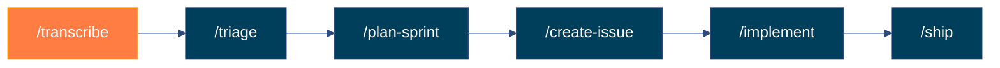
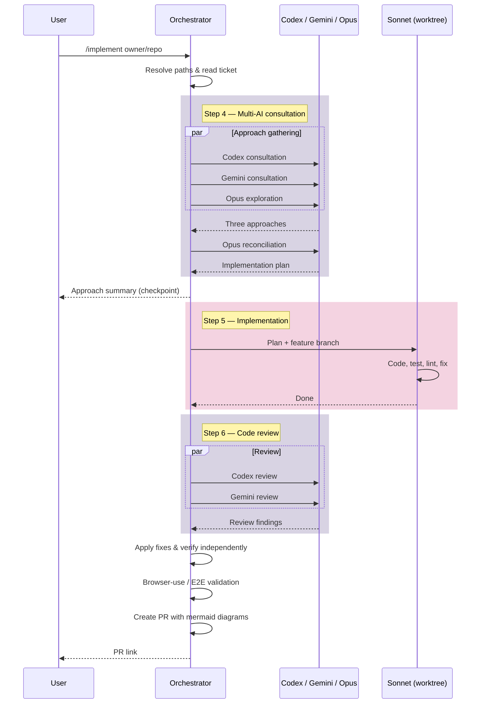
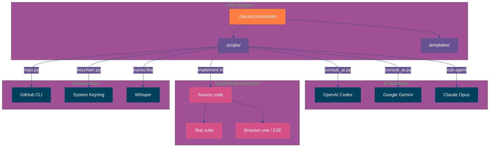

# Chief Wiggum

Agentic SDLC orchestration for Claude Code. A reusable set of skills that power an AI-driven software development lifecycle.

## Quick Start

```bash
# 1. Clone and verify
cd ~/repos/chief-wiggum
claude /setup

# 2. Add as skill source to your target project
# In your-project/.claude/settings.local.json:
{
  "commandDirs": ["~/repos/chief-wiggum/.claude/commands"]
}

# 3. Use from your target project directory (not chief-wiggum)
claude /transcribe ~/recordings/client-call.mp4
claude /triage owner/repo
claude /implement owner/repo#42
```

**Important**: Run skills from your target project directory, not from chief-wiggum itself.

## Skills

| Skill | Purpose |
|-------|---------|
| `/setup` | Verify and install all dependencies |
| `/transcribe` | Whisper transcription → structured requirements |
| `/triage` | Read and prioritise GitHub issues |
| `/plan-sprint` | Interactive sprint planning session |
| `/create-issue` | Create well-structured GitHub issues |
| `/implement` | Full implementation loop with multi-AI consultation |
| `/ship` | PR creation with mermaid architecture diagrams |
| `/update` | Refresh AI model IDs and library versions |

## Pipeline



## `/implement` — Orchestration Detail



## Architecture



## Requirements

- **Python >= 3.11**
- Claude Code CLI (`claude`)
- OpenAI Codex CLI (`codex`)
- Google Gemini CLI (`gemini`)
- GitHub CLI (`gh`)
- ffmpeg, openai-whisper (for transcription)
- Secrets stored in system keyring (managed via `python3 scripts/keychain.py`)
