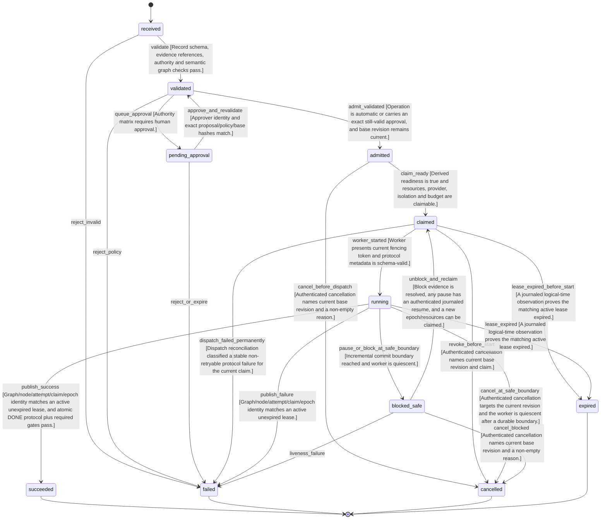

## Dynamic DAG Execution Control

The persisted proposal-to-attempt lifecycle; readiness, evidence lifecycle and candidate disposition are orthogonal context projections with explicit invariants.

### States
- `received` (initial) — Untrusted proposal received as inert data.
- `validated` — Schema and semantic validation succeeded at the named base revision.
- `pending_approval` — Privileged operation awaits an approval bound to exact proposal, policy and base hashes.
- `admitted` — Proposal is committed; readiness is derived from current journal facts.
- `claimed` — A fenced lease and dispatch outbox record are committed atomically.
- `running` — Worker is executing with the current lease epoch.
- `blocked_safe` — Worker reached a durable safe boundary and its lease is inactive; retry or unblocking creates a new claim.
- `succeeded` (terminal) — Immutable successful attempt outcome; candidate disposition may later be promoted or superseded without changing it.
- `failed` (terminal) — Immutable failed attempt outcome; any retry is a new node linked by retry_of.
- `cancelled` (terminal) — Worker is quiescent, lease fenced/released and cancellation outcome is immutable.
- `expired` (terminal) — Lease expiry ended this attempt; late outputs are fenced and a retry is a new node.

### Transitions
| From | To | Trigger | Guard Conditions |
|------|----|---------|-----------------|
| received | validated | validate | Record schema, evidence references, authority and semantic graph checks pass. |
| received | failed | reject_invalid | — |
| validated | pending_approval | queue_approval | Authority matrix requires human approval. |
| validated | admitted | admit_validated | Operation is automatic or carries an exact still-valid approval, and base revision remains current. |
| validated | failed | reject_policy | — |
| pending_approval | validated | approve_and_revalidate | Approver identity and exact proposal/policy/base hashes match. |
| pending_approval | failed | reject_or_expire | — |
| admitted | claimed | claim_ready | Derived readiness is true and resources, provider, isolation and budget are claimable. |
| admitted | cancelled | cancel_before_dispatch | Authenticated cancellation names current base revision and a non-empty reason. |
| claimed | running | worker_started | Worker presents current fencing token and protocol metadata is schema-valid. |
| claimed | expired | lease_expired_before_start | A journaled logical-time observation proves the matching active lease expired. |
| claimed | failed | dispatch_failed_permanently | Dispatch reconciliation classified a stable non-retryable protocol failure for the current claim. |
| claimed | cancelled | revoke_before_start | Authenticated cancellation names current base revision and claim. |
| running | succeeded | publish_success | Graph/node/attempt/claim/epoch identity matches an active unexpired lease, and atomic DONE protocol plus required gates pass. |
| running | failed | publish_failure | Graph/node/attempt/claim/epoch identity matches an active unexpired lease. |
| running | blocked_safe | pause_or_block_at_safe_boundary | Incremental commit boundary reached and worker is quiescent. |
| running | expired | lease_expired | A journaled logical-time observation proves the matching active lease expired. |
| running | cancelled | cancel_at_safe_boundary | Authenticated cancellation targets the current revision and the worker is quiescent after a durable boundary. |
| blocked_safe | claimed | unblock_and_reclaim | Block evidence is resolved, any pause has an authenticated journaled resume, and a new epoch/resources can be claimed. |
| blocked_safe | cancelled | cancel_blocked | Authenticated cancellation names current base revision and a non-empty reason. |
| blocked_safe | failed | liveness_failure | — |

### Invalid Transitions (must be rejected)
- received → admitted (Schema and semantic validation cannot be skipped.)
- pending_approval → admitted (Approval must return through current-revision validation.)
- admitted → running (A fenced lease and dispatch outbox must be committed first.)
- running → admitted (An attempt is never reset; retries are new nodes.)
- running → claimed (Lease epochs cannot move backwards.)
- succeeded → failed (Attempt outcomes are immutable.)
- succeeded → cancelled (Attempt outcomes are immutable.)
- succeeded → running (A retry is a new node.)
- failed → running (A retry is a new node.)
- failed → succeeded (Attempt outcomes are immutable.)
- cancelled → running (Cancellation is terminal and fenced.)
- cancelled → admitted (A cancelled attempt cannot be revived.)
- expired → running (Expired epoch outputs are fenced; retry uses a new node.)
- expired → succeeded (Late success from a stale epoch is rejected.)
- blocked_safe → running (Unblocking requires a new fenced claim epoch.)

### Invariants
- **INV-dag-001** [consistency]: The transactional GraphJournal is the sole writer of graph_revision and canonical execution/control state.
- **INV-dag-002** [data_integrity]: Every committed record is hash-chained; only an uncommitted partial tail is recoverable, while complete or mid-journal corruption fails closed.
- **INV-dag-003** [consistency]: journal_seq advances for every durable event; graph_revision advances exactly once only for accepted readiness/authority-affecting changes.
- **INV-dag-004** [data_integrity]: schedule_hash and audit_state_hash use schema-versioned canonical UTF-8 JSON with sorted object keys, defined list/set ordering, NFC Unicode, integer-only numbers, explicit null/absence rules and LF line endings; replay reproduces both byte-for-byte.
- **INV-dag-005** [authorization]: Tracker/ratchet remain authoritative for human intent; execution imports pinned facts one-way and never writes intent back.
- **INV-dag-006** [consistency]: Static projection preserves the exact six fields, sorting, warnings and exit-code contract of plan_waves.py.
- **INV-dag-007** [consistency]: Readiness is a pure derived predicate, never independently mutable state.
- **INV-dag-008** [temporal]: Every exogenous scheduling input is an immutable event or content-hashed policy/observation; replay never queries live time, tracker, config or health.
- **INV-dag-009** [operational_safety]: Claim and dispatch-request outbox are atomic; recovery reconciles the outbox before issuing a new epoch.
- **INV-dag-010** [authorization]: All worker outputs and promotion/Git effects require matching graph, node, attempt, claim, epoch, schedule and payload identities plus an active unexpired lease; stale workers may leave bytes but cannot admit or promote them.
- **INV-dag-011** [consistency]: Attempt outcome and candidate disposition are orthogonal; promotion/supersession never rewrites terminal success or failure.
- **INV-dag-012** [operational_safety]: At most one candidate per group is promoted, selected under CAS from hard-gate-passing successful candidates with frozen independent verifier hashes.
- **INV-dag-013** [operational_safety]: Candidate fan-out is refused unless isolation covers worktrees plus repo-global refs/config/hooks, ports, databases, caches and other declared shared resources; git stash is forbidden.
- **INV-dag-014** [operational_safety]: Pause and cancel become effective only at a durable safe boundary after the worker is quiescent and its lease is released or fenced.
- **INV-dag-015** [consistency]: Provider routing is deterministic from pinned capabilities, health, budgets, evidence and policy, with explicit stable tie-breaks.
- **INV-dag-016** [authorization]: Escalation requires an objective evidence trigger; model self-confidence alone cannot escalate.
- **INV-dag-017** [authorization]: An artifact author and verifier must belong to different configured independence groups; absence fails closed.
- **INV-dag-018** [consistency]: The OpenRouter execution adapter is model-agnostic and no workflow/routing code hard-codes model or vendor strings.
- **INV-dag-019** [authorization]: Credentials never enter model-controlled argv, environment, prompt, task files, event metadata or logs; the helper is outside and uncallable from the model sandbox.
- **INV-dag-020** [data_integrity]: Experiment pre-registration is ratchet-bound before the first run and fixes factorial arms, corpus/strata, metrics, budgets, tools, verifier, stopping and analysis rules.
- **INV-dag-021** [consistency]: Experimental arms use the same harness, sandbox, tools, verifier and budget policy except for explicitly randomized factors; causal claims never exceed crossed randomized cells.
- **INV-dag-022** [operational_safety]: Anonymous previews, including the currently configured Ox Alpha experiment arm, remain external-preview-tier absent public weights/license evidence; unusually high probe usage is a calibration risk and circuit-breaker input.
- **INV-dag-023** [consistency]: Static fallback preserves both the exact plan_waves.py projection contract and wave-barrier dispatch, gating and failure semantics; journal failure never silently becomes a dynamic or partial executor.
- **INV-dag-024** [authorization]: Candidate promotion scoring is identity-blind and Git publication can originate only from the winner-selected promotion outbox, never ordinary attempt success.
- **INV-dag-025** [data_integrity]: Experiment runs follow the preregistered deterministic blocked-randomization and interleaving schedule; causal language requires assignment-log compliance and stable identity treatment.
- **INV-dag-026** [temporal]: Every blocked_safe node has a journaled wake condition/deadline and eventually becomes reclaimable, cancelled or a diagnosed liveness failure under logical time.
