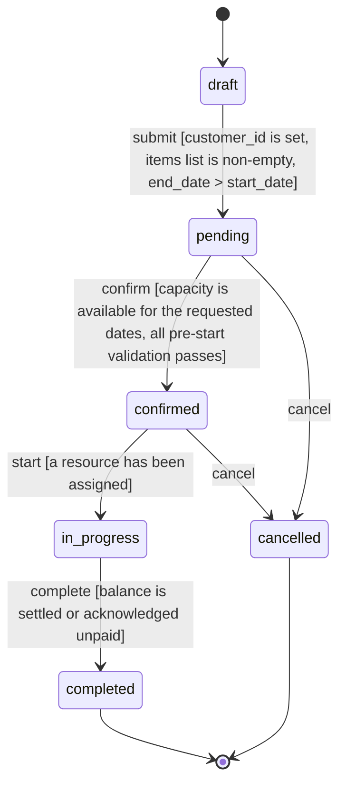

## Order Status State Machine

Tracks order lifecycle from creation through completion or cancellation

### States
- `draft` (initial) — Initial state — admin-created, incomplete data
- `pending` — Submitted via intake, awaiting confirmation
- `confirmed` — Approved, awaiting start
- `in_progress` — Work in progress
- `completed` (terminal) — Order fulfilled
- `cancelled` (terminal) — Terminated before completion

### Transitions
| From | To | Trigger | Guard Conditions |
|------|----|---------|-----------------|
| draft | pending | submit | customer_id is set, items list is non-empty, end_date > start_date |
| pending | confirmed | confirm | capacity is available for the requested dates, all pre-start validation passes |
| pending | cancelled | cancel | — |
| confirmed | in_progress | start | a resource has been assigned |
| confirmed | cancelled | cancel | — |
| in_progress | completed | complete | balance is settled or acknowledged unpaid |

### Invalid Transitions (must be rejected)
- draft → confirmed (Cannot skip pending validation)
- completed → in_progress (Completion is irreversible)
- cancelled → draft (Cancellation is terminal — no transitions out)
- cancelled → pending (Cancellation is terminal — no transitions out)
- cancelled → confirmed (Cancellation is terminal — no transitions out)

### Invariants
- **INV-001** [data_integrity]: Item names are NEVER stored as strings on orders. Always reference item_ids and resolve at read time.
- **INV-002** [data_integrity]: Every order with status >= pending has a non-null customer_id that references a valid customer.
- **INV-003** [data_integrity]: end_date > start_date on every order, enforced at write time.
- **INV-004** [data_integrity]: An order in in_progress MUST have a resource_id assigned.
- **INV-005** [consistency]: Dashboard, List View, Calendar, and Detail View MUST derive record counts from the same query. No screen-specific counting logic.
- **INV-006** [consistency]: Capacity View and Summary View MUST use the same occupancy calculation. Define once, use everywhere.
- **INV-007** [operational_safety]: If an operation depends on an external service (email, payment), the success toast MUST NOT display unless the service call succeeded.
