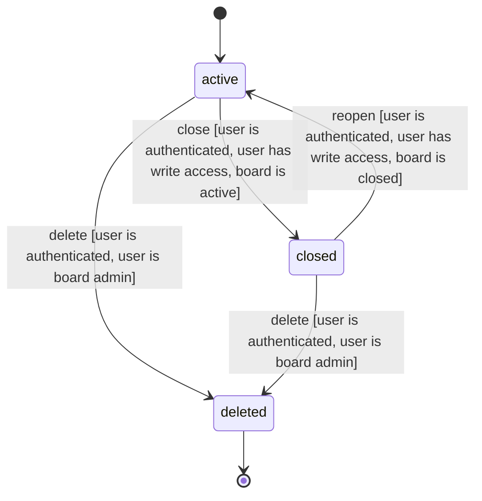

## Board Lifecycle

State machine for Board entity, extracted from domain model

### States
- `active` (initial) — Board in active state
- `closed` — Board in closed state
- `deleted` (terminal) — Board in deleted state

### Transitions
| From | To | Trigger | Guard Conditions |
|------|----|---------|-----------------|
| active | closed | close | user is authenticated, user has write access, board is active |
| closed | active | reopen | user is authenticated, user has write access, board is closed |
| active | deleted | delete | user is authenticated, user is board admin |
| closed | deleted | delete | user is authenticated, user is board admin |

### Invalid Transitions (must be rejected)
- deleted → active (deleted is a terminal state — no transitions out)
- deleted → closed (deleted is a terminal state — no transitions out)
