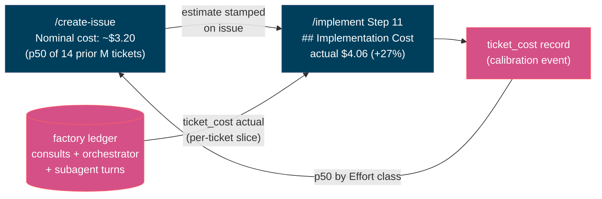

# Per-Ticket Implementation Cost

Every issue gets a **nominal cost estimate** when it is written; every PR gets
the **measured actual** when it ships; the actual feeds back into the estimator.
`scripts/ticket_cost.py` is the whole surface — the metering underneath is the
existing factory ledger (`scripts/factory_log.py`, see
[factory-telemetry.md](factory-telemetry.md)), not a second cost system.

## Cost basis

**Nominal model spend only** — the same definition as `build_cost.py`'s
`nominal_usd`: tokens × the grounded per-model rates in
`config/model_pricing.json` (INV-fh-002: prices come from the table, never
memory; an unpriced model's cost is *omitted* and flagged, never zeroed).
Cache-aware for Claude Code layers (`cost_for_usage`). Three layers, summed:

| Layer | Metered by | Tagged with the ticket |
|--|--|--|
| Orchestrator (`repl_main_thread`) | transcript/OTEL ingest | at ingest (`--ticket`) |
| Subagents (+ `worker` events) | transcript/OTEL ingest | at ingest (`--ticket`) |
| Consults (codex/gemini/…) | `consult_ai.py` | at call time (`--ticket`) |

Human time, CI minutes, and plan-share economics are **out** — for the true
economic cost of factory compute under a fixed plan, see `build_cost.py`
(#257), which prices bets, not tickets.

## Honesty rules

The fail-open bug class (chief-wiggum#289) applies to money too:

- **No records is UNMETERED, never $0.** An empty slice means telemetry didn't
  flow — the PR section says so and tells you how to meter the next build.
- **Unpriced calls flag `cost_partial`** and the rendered total says it
  understates; the unpriced call count is printed with its denominator.
- **An estimate below `--min-samples` (default 3) is UNRESOLVED, never
  guessed.** `/create-issue` stamps the UNRESOLVED line verbatim; it
  self-resolves as PRs merge and calibrations accumulate.
- **Partial/unmetered actuals never feed the estimator** — a lower bound would
  drag the p50 down; exclusions are counted in `excluded_partial`.

## Attribution

Consult records carry the ticket exactly (passed per call). Claude Code's own
turns don't know the ticket, so the transcript ingest tags them under a guard,
never blindly:

- `--cwd-prefix <worktree>` — worktree-precise; what `/implement-wave` workers
  should use, since parallel tickets on the same repo are only separable by cwd.
- otherwise, cwd-derived repo must match `--repo` — right for a solo
  `/implement` session windowed by `--since-ts` (the Step 1 build-start stamp).
  A concurrent session on the *same* repo in the same window would bleed in;
  pass `--cwd-prefix` when that matters.

Dedup is by request id, so a turn ingested untagged earlier can't be re-tagged:
tag at first ingest, which is what `/implement` Step 11 does.

## Workflow wiring

- **`/create-issue`** — after picking the Effort size:
  `ticket_cost.py estimate --effort M` → stamp the output line into the issue's
  `Nominal cost` field verbatim.
- **`/implement` Step 1** — `export CW_TELEMETRY=1` (consults meter) and stamp
  `$TICKET_TMP/build-start-ts`.
- **`/implement` Step 11** — `factory_log.py ingest-claude-transcripts --repo …
  --ticket … --since-ts …`, then `ticket_cost.py actual --format markdown`
  (plus `--estimate` when the issue carries a nominal figure) →
  `draft_pr.py --implementation-cost …` renders the PR's
  `## Implementation Cost` section. After the PR exists:
  `ticket_cost.py record --effort <size>` journals the calibration point.

Report-only by construction: cost is information for the human on the issue and
PR. It is never a gate, and there is no threshold that blocks a ship.
