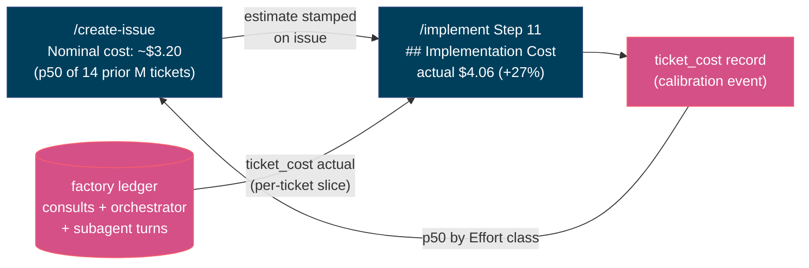

# Per-Ticket Implementation Cost

Every issue gets a **nominal cost estimate** when it is written; every PR gets
the **measured actual** when it ships; the actual feeds back into the estimator.
`scripts/ticket_cost.py` is the whole surface — the metering underneath is the
existing factory ledger (`scripts/factory_log.py`, see
[factory-telemetry.md](factory-telemetry.md)), not a second cost system.

## Cost basis

**Nominal model spend only** — the same definition as `build_cost.py`'s
`nominal_usd`: tokens × the grounded per-model rates in
`config/model_pricing.json` (INV-fh-002: prices come from the table, never
memory; an unpriced model's cost is *omitted* and flagged, never zeroed).
Cache-aware for Claude Code layers (`cost_for_usage`). Three layers, summed:

| Layer | Metered by | Tagged with the ticket |
|--|--|--|
| Orchestrator (`repl_main_thread`) | transcript/OTEL ingest | at ingest (`--ticket`), or by cwd+window at read time |
| Subagents (+ `worker` events) | transcript/OTEL ingest — recurses through `<session>/subagents/**` (chief-wiggum#345; a two-level glob missed ~75% of turn volume) | at ingest (`--ticket`), or by cwd+window at read time |
| Consults (codex/gemini/…) | `consult_ai.py` | at call time (`--ticket`) — `run_review.py`'s `--ticket` flag is what makes review-quorum consults attribute (#345) |

Human time, CI minutes, and plan-share economics are **out** — for the true
economic cost of factory compute under a fixed plan, see `build_cost.py`
(#257), which prices bets, not tickets.

**Nominal, not billed.** Every figure this script renders is *nominal* API
list pricing (tokens × `config/model_pricing.json`) — the same basis
`build_cost.py`'s `nominal_usd` uses. On a metered API key that IS what you
pay; on a Claude Code subscription plan it is not: the plan is a fixed
periodic cost, and `build_cost.py`'s `plan_share_pct` (chief-wiggum#257) is
the only number in this factory that expresses what a build cost against a
fixed-plan budget. A PR section showing several dollars a day of nominal
Claude-layer spend — now visible in full for the first time as of
chief-wiggum#345's sub-agent capture fix — will read as an invoice to anyone
who skims it unless they already know this. Every rendered surface keeps the
"nominal model spend" wording for exactly this reason; do not read a
`## Implementation Cost` total as a bill.

## Honesty rules

The fail-open bug class (chief-wiggum#289) applies to money too:

- **No records is UNMETERED, never $0.** An empty slice means telemetry didn't
  flow — the PR section says so and tells you how to meter the next build.
- **Unpriced calls flag `cost_partial`** and the rendered total says it
  understates; the unpriced call count is printed with its denominator.
- **An estimate below `--min-samples` (default 3) is UNRESOLVED, never
  guessed.** `/create-issue` stamps the UNRESOLVED line verbatim; it
  self-resolves as PRs merge and calibrations accumulate.
- **Partial/unmetered actuals never feed the estimator** — a lower bound would
  drag the p50 down; exclusions are counted in `excluded_partial`.

## Attribution

Consult records carry the ticket exactly (passed per call). Claude Code's own
turns don't know the ticket, so the transcript ingest tags them under a guard,
never blindly:

- `--cwd-prefix <worktree>` — worktree-precise; what `/implement-wave` workers
  should use, since parallel tickets on the same repo are only separable by cwd.
- otherwise, cwd-derived repo must match `--repo` — right for a solo
  `/implement` session windowed by `--since-ts` (the Step 1 build-start stamp).
  A concurrent session on the *same* repo in the same window would bleed in;
  pass `--cwd-prefix` when that matters.

Dedup is by request id, so a turn ingested untagged earlier can't be re-tagged:
tag at first ingest, which is what `/implement` Step 11 does.

### Read-time window slicing (recovering an untagged turn)

An automatic catch-up ingest (`/implement` Step 1, `/implement-wave`'s
wave-level catch-up, `/reflect`'s Step 1b) can sweep up a turn BEFORE the
ticket it belongs to is known — that turn is ingested untagged, and dedup
means it can never be tagged afterwards. `ticket_cost.py actual` recovers it
at READ time instead: pass the same `--cwd-prefix`/`--since-ts`/`--until-ts`
the build used, and `summarize_ticket` counts a record that matches EITHER the
ticket tag OR falls inside that cwd+time window (never double-counting a
record that matches both). This is what makes automatic catch-up ingest safe
under concurrency — a wave worker's catch-up ingesting a sibling ticket's
in-flight turns doesn't strand them, because the sibling's own `actual` call
recovers them by window instead of by tag.

## Coverage — the capture denominator (chief-wiggum#345)

A rendered slice that silently omits a layer it never saw invites a reader to
take a consult-only figure as the total — the #381 incident: two reviewer
consults ran, `ticket_cost.py actual --ticket 381` read `$0.00`, and nothing
in the output said why. `ticket_cost.py actual` now computes a **coverage**
block alongside the cost table — printed above the footnote in markdown, as
extra lines in text mode, and as `summary["coverage"]` in JSON — naming each
layer's status from evidence INDEPENDENT of the rendered slice:

| Status | Meaning |
|--|--|
| `captured` | records present, every call priced |
| `captured-partial` | records present, some calls unpriced (both counts printed) |
| `uncaptured` | zero records for this layer, AND independent evidence (a transcript-turn count for Claude layers, an untagged-consult count for the consult layer) says the layer actually ran |
| `unknown` | zero records and no independent evidence source was scanned — never reported as `captured`, never as `$0` |

The Claude-layer evidence comes from `factory_log.count_transcript_turns()` —
a read-only scan of the transcript corpus, bounded by `--since-ts` (files
older than the window are skipped by mtime without being read, so this stays
cheap enough to run at PR time) and never run at all without a window (an
unbounded corpus scan isn't worth its cost — no window means `unknown`, not a
fabricated scan). The consult-layer evidence is the ledger itself: zero
TAGGED consults for this ticket but untagged same-repo consults sitting in the
window is exactly the #381 fingerprint — a review quorum that ran but never
attributed.

`--exit-code-on-gap` makes coverage enforceable for a caller that wants it
(exits 3 when coverage isn't `complete`) — **opt-in only**; the default stays
exit 0, because `ticket_cost.py` is report-only by construction (see below).
`draft_pr.py --require-cost` is the sibling enforcement point: it fails loudly
when the Implementation Cost section is missing or empty, so a PR can no
longer ship with a hand-edited "see ledger" stub.

## Workflow wiring

- **`/create-issue`** — after picking the Effort size:
  `ticket_cost.py estimate --effort M` → stamp the output line into the issue's
  `Nominal cost` field verbatim.
- **`/implement` Step 1** — `export CW_TELEMETRY=1` (consults meter), stamp
  `$TICKET_TMP/build-start-ts`, and run a catch-up transcript ingest bounded by
  `--until-ts` on that stamp (so it can never consume this build's own turns).
- **`/implement` Step 7** — `run_review.py --ticket "$issue_number"` so
  review-phase consults attribute (chief-wiggum#345 AC2).
- **`/implement` Step 11** — `factory_log.py ingest-claude-transcripts --repo …
  --ticket … --since-ts …`, then `ticket_cost.py actual --format markdown
  --cwd-prefix <worktree> --since-ts <build-start>` (plus `--estimate` when the
  issue carries a nominal figure) → `draft_pr.py --implementation-cost … --require-cost`
  renders the PR's `## Implementation Cost` section (with its Coverage block)
  and refuses to ship a stub. After the PR exists:
  `ticket_cost.py record --effort <size>` journals the calibration point.
- **`/implement-wave`** — `export CW_TELEMETRY=1` and one wave-level catch-up
  ingest before the first wave starts; each worker's own transcript ingest and
  `ticket_cost.py actual` calls must pass `--cwd-prefix` pointed at their own
  worktree (workers share one target repo, so a bare cwd-derived repo match
  would cross-bill a sibling ticket's spend).
- **`/reflect`** — a Step 1b catch-up ingest (`--since-days 30`, wider than a
  single build) before the factory-log analysis runs.

Report-only by construction: cost is information for the human on the issue and
PR. It is never a gate by default, and there is no threshold that blocks a ship
unless the caller opts in (`--exit-code-on-gap`, `draft_pr.py --require-cost`).
