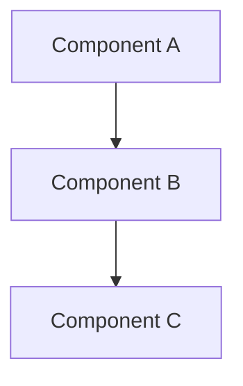

## Summary

<!-- What was implemented and why -->

Closes #<!-- issue number -->

## Architecture



<!-- Replace with actual mermaid diagram showing components changed and data flow -->

## Changes

- <!-- Change 1 -->
- <!-- Change 2 -->
- <!-- Change 3 -->

## Test Evidence

### Unit / Integration Tests
```
<!-- Paste test output -->
```

### E2E / Browser-Use Validation
<!-- Screenshots or pass/fail summary -->

| Scenario | Result |
|----------|--------|
| <!-- scenario 1 --> | PASS/FAIL |

## Review Checklist

- [ ] Tests pass locally
- [ ] No new warnings or lint errors
- [ ] Multi-AI review feedback addressed
- [ ] Browser-use validation completed
- [ ] No secrets or credentials committed
