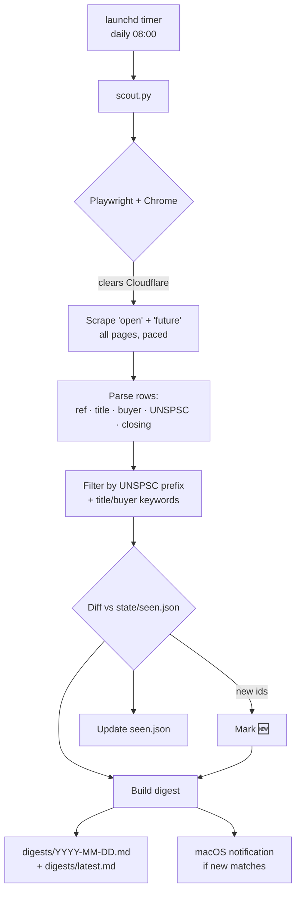

# VIC Gov RFT scout

A periodic scout for **Victorian Government tender opportunities**. It scrapes
[tenders.vic.gov.au](https://www.tenders.vic.gov.au), filters listings to your
interest profile, remembers what it has already seen, and writes a Markdown
digest that highlights **new** opportunities — including *advance notices* that
haven't opened yet (weeks of lead time to prepare a bid).

There is no RSS feed or public API for this portal, and it sits behind
Cloudflare, so the scout drives a real browser to clear the challenge. Two fetch
backends are provided (see **Fetching** below).

## Design

The tool splits into a **deterministic core** (parse → filter → diff → digest —
pure functions, fully unit-tested against real captured listings) and a **fetch
layer** (the fragile, Cloudflare-facing part). The core can be driven from a
JSON array (`--from-json`) with no browser at all, which is how the tests and
the claude-in-chrome runner feed it.

## What it watches

| Preset | Meaning | Why it matters |
|---|---|---|
| `open` | Currently open tenders (RFT / EOI / RFI / RFQ) | You can bid now |
| `future` | Advance Tender Notices | Not open yet — best early signal, most lead time |

Listings are matched to a profile of **software / digital / web + data / AI /
analytics + psychosocial / wellbeing / compliance** (edit `config.json`). A
listing matches if any of its UNSPSC codes starts with a configured prefix, or
its title/buyer contains a configured keyword.

## Flow



## Setup

```bash
cd tools/vic-rft-scout
python3 -m venv .venv
. .venv/bin/activate
pip install -r requirements.txt
# Uses your installed Chrome (browser_channel: "chrome"). If you'd rather use
# Playwright's bundled Chromium, run:  playwright install chromium
```

## Run

```bash
. .venv/bin/activate
python scout.py                       # scrape (Playwright), filter, write digest, notify
python scout.py --dry-run             # don't update the seen-cache (everything reads as new)
python scout.py --no-notify           # skip the macOS notification
python scout.py --date 2026-07-09     # override the run date (testing)
python scout.py --from-json rows.json # skip scraping; use pre-fetched rows (runner / offline)
```

## Fetching (Cloudflare)

The portal is behind Cloudflare's managed challenge, which is **rate-based**.
Two backends:

1. **Playwright (default)** — `python scout.py`. Self-contained, no Claude
   needed. Clears the challenge from a real Chrome, paces requests, and retries
   with backoff. At a gentle once-a-day cadence this is usually fine, but a
   fresh headless browser can still get challenged; a persistently blocked page
   is logged and skipped (partial digest, not a crash).
2. **claude-in-chrome runner (most reliable)** — drives *your* Chrome, which
   already holds a warm Cloudflare clearance, so it isn't bot-challenged. See
   `runner_prompt.md`; it fetches all pages, writes `rows.json`, and calls
   `scout.py --from-json rows.json`. Use this if the Playwright path gets blocked
   in your environment.

## Tests

The core logic is covered by `test_scout.py` (no network — uses
`fixtures/sample_listings.json`, real listings captured from the portal,
including the "Victoria → ict" false-positive traps):

```bash
. .venv/bin/activate && python -m unittest -v
```

Output:
- `digests/YYYY-MM-DD.md` — that day's digest
- `digests/latest.md` — always the most recent
- `state/seen.json` — first-seen date per tender id (drives the 🆕 flag)

`state/` and `digests/` are git-ignored — they're your local running state.

## Schedule it (launchd, macOS)

The scout runs locally and needs Chrome, so it's scheduled with **launchd** in
your user session (not a cloud cron — Cloudflare needs a real browser).

```bash
# 1. Edit the plist: set the absolute path to this folder and your python.
#    (placeholders __SCOUT_DIR__ are marked inside the file)
# 2. Install it:
cp com.plwp.vic-rft-scout.plist ~/Library/LaunchAgents/
launchctl load ~/Library/LaunchAgents/com.plwp.vic-rft-scout.plist
# Runs daily at 08:00. To run it once now:
launchctl start com.plwp.vic-rft-scout
# Logs: /tmp/vic-rft-scout.{out,err}.log
# To stop scheduling:
launchctl unload ~/Library/LaunchAgents/com.plwp.vic-rft-scout.plist
```

> **Note:** launchd fires the job when the Mac is awake; if it's asleep at
> 08:00, the run happens shortly after wake. If the Mac is off, that day is
> skipped (the seen-cache means the next run still surfaces anything new).

## Tuning the profile

Edit `config.json`:
- `unspsc_prefixes` — 8-digit UNSPSC code prefixes (e.g. `"43"` = all IT/telecom,
  `"8413"` = employee-assistance/HR wellbeing).
- `keywords` — grouped title/buyer substrings; the group name shows up in the
  digest's "Why" column.
- `presets` — `["open"]` for bidding-now only, or add `"future"` for lead-time.
- `request_delay_seconds` / `retry_backoff_seconds` / `max_retries` — Cloudflare
  is rate-based; raise the delay if you see persistent blocks.

## Limitations

- **Cloudflare is rate-based.** The Playwright backend paces requests and retries
  with backoff; a persistent block on a page is logged and that page is skipped
  (partial digest rather than a crash). If it blocks consistently, use the
  claude-in-chrome runner.
- **Listing-level only.** It reads the search results, not each tender's full
  document set. The digest links straight to the tender page for the detail.
- **No dollar values.** The portal's listing rows don't include contract value.
- **Read-only.** The scout never registers, bids, submits, or downloads — it
  only reads public listings.
